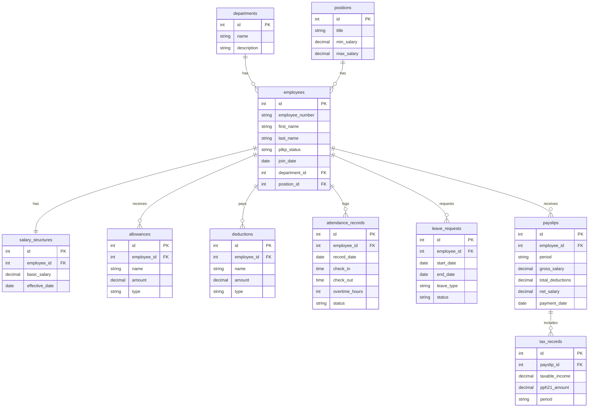

# Product Requirements Document (PRD): Sistem Penggajian (Payroll)

## 1. Pendahuluan
**Masalah:** Perusahaan saat ini membutuhkan sistem otomatis untuk menghitung gaji, tunjangan, potongan, pajak, dan mencetak slip gaji karyawan dengan akurat dan efisien, untuk menggantikan proses manual yang rawan kesalahan dan lambat.

**Tujuan:** Membangun aplikasi Sistem Penggajian (Payroll) terpadu yang mempermudah pengelolaan komponen gaji secara otomatis berdasarkan data kehadiran, cuti, serta kepatuhan pada regulasi perpajakan (khususnya PPh 21).

**Target Pengguna:**
- **Tim HR:** Mengelola data karyawan, departemen, jabatan, dan data absensi/cuti.
- **Keuangan/Payroll:** Mengelola komponen penggajian, tunjangan, potongan, perhitungan pajak PPh 21, dan melakukan validasi serta eksekusi penggajian bulanan.
- **Karyawan:** Mengakses slip gaji secara mandiri, melihat rincian gaji, serta mengajukan permohonan cuti.

## 2. Fitur Utama
Sistem ini akan mendukung operasi penggajian dari hulu ke hilir dengan fitur utama sebagai berikut:
1. **Data Karyawan dan Jabatan:** Pengelolaan profil lengkap karyawan, riwayat posisi, penempatan departemen, dan tingkat jabatan (grade).
2. **Struktur Gaji Pokok dan Komponen:** Penetapan gaji pokok berdasarkan jabatan atau struktur kompensasi standar perusahaan.
3. **Tunjangan dan Potongan:** Konfigurasi tunjangan (transport, uang makan, tunjangan jabatan) dan potongan (BPJS Kesehatan, BPJS Ketenagakerjaan, pinjaman/kasbon).
4. **Rekap Absensi untuk Kalkulasi:** Integrasi data kehadiran, jam kerja, keterlambatan, dan lembur untuk perhitungan variabel gaji akhir.
5. **Perhitungan Pajak PPh 21:** Perhitungan otomatis beban pajak PPh 21 berdasarkan status PTKP (Penghasilan Tidak Kena Pajak) masing-masing karyawan secara dinamis.
6. **Pengajuan dan Persetujuan Cuti:** Manajemen cuti tahunan, sakit, dan izin khusus (termasuk kebijakan unpaid leave yang mempengaruhi kalkulasi gaji).
7. **Generate Slip Gaji Otomatis:** Pembuatan dan distribusi slip gaji digital (PDF/Web) secara berkala yang bisa diunduh langsung oleh karyawan.

## 3. Skema Data & Arsitektur
Sistem ini dirancang menggunakan arsitektur relasional untuk memastikan integritas data perhitungan penggajian. Selain tabel `users` (autentikasi) dan `settings` (konfigurasi aplikasi), sistem minimal mencakup 10 tabel inti berikut:

### Penjelasan Naratif Tabel
1. **`departments`**: Menyimpan master data divisi atau departemen perusahaan (contoh: IT, HR, Finance).
2. **`positions`**: Menyimpan master data jabatan/posisi beserta rentang gaji pokok standar untuk jabatan tersebut.
3. **`employees`**: Menyimpan profil detail karyawan, termasuk NIK, tanggal bergabung, status pajak (PTKP), dan relasi referensi ke department dan position.
4. **`salary_structures`**: Mendefinisikan struktur gaji dasar (basic salary) yang disepakati dan efektif untuk setiap karyawan.
5. **`allowances`**: Menyimpan daftar tunjangan yang diterima oleh karyawan (baik yang bersifat tetap/fixed maupun tidak tetap/variable).
6. **`deductions`**: Menyimpan data potongan untuk karyawan (seperti asuransi kesehatan, BPJS, cicilan pinjaman, dsb).
7. **`attendance_records`**: Merekam jam kerja, waktu check-in/check-out, keterlambatan, jumlah lembur (overtime), dan status absensi harian karyawan.
8. **`leave_requests`**: Mengelola pengajuan cuti beserta periode, jenis cuti, dan status persetujuannya (Pending, Approved, Rejected).
9. **`tax_records`**: Menyimpan historis rinci perhitungan pajak (PPh 21) setiap karyawan per periode penggajian, mempermudah pelaporan pajak tahunan.
10. **`payslips`**: Tabel utama hasil kalkulasi gaji per periode yang menyimpan rekap akhir (gross salary, total deductions, net pay) untuk dicetak sebagai slip gaji.

### Visualisasi ERD (Entity Relationship Diagram)

